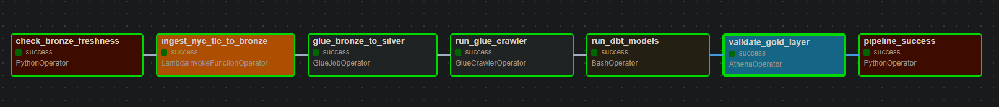
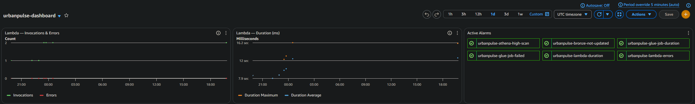
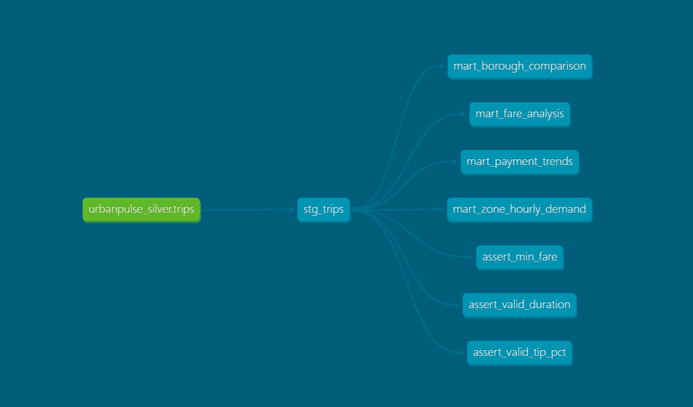
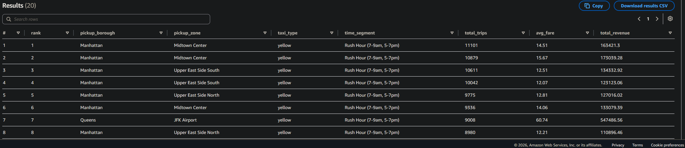
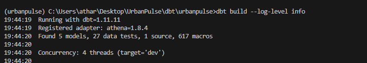
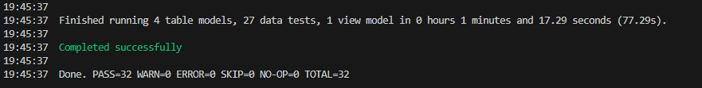

# UrbanPulse 🚕

End-to-end data engineering pipeline on AWS — processing 3M+ real NYC taxi trips monthly using a medallion architecture.


---

## Pipeline Overview

```
NYC TLC Open Data
      │
      ▼
  AWS Lambda          ← monthly ingest via EventBridge cron
      │
      ▼
  S3 Bronze           ← raw Parquet, partitioned by year/month/source
      │
      ▼
  AWS Glue ETL        ← PySpark: clean, deduplicate, enrich with zone names
      │
      ▼
  S3 Silver           ← typed Parquet + 10 derived columns
      │
      ▼
  dbt models          ← 4 mart tables + 14 data quality tests
      │
      ▼
  S3 Gold             ← aggregated, business-ready
      │
      ▼
  Amazon Athena       ← SQL analytics on Gold layer

  Airflow (EC2)       ← orchestrates all 7 tasks end-to-end
  Terraform           ← all infrastructure as code
  GitHub Actions      ← CI/CD with AWS OIDC (zero stored keys)
  CloudWatch          ← 6 alarms + dashboard + SNS email alerts
```

---

## Results

### Airflow DAG — full pipeline run


### CloudWatch dashboard


### dbt lineage graph


### Athena — peak demand zones query


### dbt test results




---

## Tech Stack

| Layer | Tool |
|---|---|
| Ingestion | AWS Lambda + EventBridge |
| Storage | S3 — Bronze / Silver / Gold |
| Processing | AWS Glue (PySpark) |
| Transformation | dbt-athena |
| Orchestration | Apache Airflow 2.9 on EC2 c7i-flex.large |
| Analytics | Amazon Athena |
| Catalog | AWS Glue Data Catalog |
| IaC | Terraform |
| CI/CD | GitHub Actions + AWS OIDC |
| Monitoring | CloudWatch + SNS |

---

## Data Quality

14 dbt tests run automatically on every pipeline execution:

- `not_null` + `accepted_values` on all key columns
- Fare ≥ $3.00 (NYC base rate), duration 1–240 min
- Location IDs within valid NYC range (1–263)
- Trip distance > 0 and fare amount > 0

```
dbt build

Running 5 models .......... OK
Running 14 tests .......... 14 passed, 0 failed
```

---

## Showcase Queries

Five analytics queries saved in Athena workgroup `urbanpulse-wg`:

| # | Query | Insight |
|---|---|---|
| 1 | Peak demand zones | Top pickup zones — rush hour vs off-peak |
| 2 | Fare anomaly detection | Zones with z-score > 2 from city average |
| 3 | Borough revenue matrix | Pickup × dropoff fare heatmap |
| 4 | Tip behaviour analysis | Tip patterns by payment type and time |
| 5 | Payment method shift | Credit card vs cash trends over time |

---

## Reproduce in 10 Commands

```bash
# 1. Clone
git clone https://github.com/Anand09-in/urbanpulse && cd urbanpulse

# 2. Generate a passphrase-free SSH key for EC2 access
ssh-keygen -t ed25519 -f ~/.ssh/urbanpulse_ci -N ""

# 3. Bootstrap Terraform state bucket (one-time, ap-south-1)
aws s3api create-bucket --bucket urbanpulse-tf-state-798644229089 \
  --region ap-south-1 \
  --create-bucket-configuration LocationConstraint=ap-south-1 \
  --profile urbanpulse

# 4. Deploy all infrastructure (~3 min)
cd infra
terraform init -backend-config="profile=urbanpulse"
terraform apply \
  -var="my_ip_cidr=$(curl -s ifconfig.me)/32" \
  -var="github_username=Anand09-in" \
  -var="alert_email=your@email.com"

# 5. Ingest NYC TLC data into Bronze
aws lambda invoke \
  --function-name urbanpulse-ingest \
  --payload '{"year":"2026","month":"01"}' \
  --cli-binary-format raw-in-base64-out \
  --profile urbanpulse \
  response.json

# 6. Run Glue ETL — Bronze → Silver
aws glue start-job-run \
  --job-name urbanpulse-bronze-to-silver \
  --arguments '{"--year":"2026","--month":"01"}' \
  --profile urbanpulse

# 7. Run Silver crawler — register schema in Glue Catalog
aws glue start-crawler --name urbanpulse-silver-crawler --profile urbanpulse

# 8. Run dbt — Silver → Gold + 14 quality tests
cd ../dbt/urbanpulse
dbt run --profiles-dir . && dbt test --profiles-dir .

# 9. Get EC2 IP and open Airflow UI
terraform -chdir=../../infra output ec2_public_ip
# Visit http://<EC2_IP>:8080  (admin / admin)

# 10. Query Gold layer in Athena (workgroup: urbanpulse-wg)
aws athena start-query-execution \
  --query-string "SELECT * FROM urbanpulse_gold.mart_zone_hourly_demand LIMIT 10" \
  --work-group urbanpulse-wg \
  --profile urbanpulse
```

---

## Cost

**~$0.03 / month** on AWS free tier.  
Full breakdown: [`docs/cost-estimate.md`](docs/cost-estimate.md)

| What was avoided | Saving |
|---|---|
| Amazon MSK → Kafka on EC2 | ~$150/month |
| EMR → AWS Glue | ~$80/month |
| Kinesis Firehose → Lambda | ~$15/month |

---

## Project Structure

```
urbanpulse/
├── infra/          Terraform — all 6 modules (networking, IAM, S3, Lambda, Glue, monitoring)
├── ingestion/      Lambda function + unit tests
├── transform/      Glue PySpark ETL job
├── dbt/            4 mart models + 14 quality tests
├── dags/           Airflow DAG (7 tasks)
├── analytics/      5 showcase Athena SQL queries
├── docs/           Cost estimate + screenshots
└── .github/        CI + Deploy workflows
```

---

## Interview Talking Points

1. **Real data** — 3M+ rows of actual NYC taxi data, not simulated. Had to handle real issues: negative fares, invalid zone IDs, duplicate trips.
2. **Medallion architecture** — Bronze / Silver / Gold with clear separation of concerns.
3. **Data quality** — 14 dbt tests including business rules encoded as singular tests.
4. **IaC from day one** — entire infrastructure reproducible with `terraform apply`.
5. **Zero stored AWS keys** — GitHub Actions uses OIDC to assume an IAM role.
6. **Cost aware** — $0.03/month. Documented every free tier decision.
7. **CI/CD** — no manual deploys. DAGs, Glue scripts, and infra all deployed automatically.
